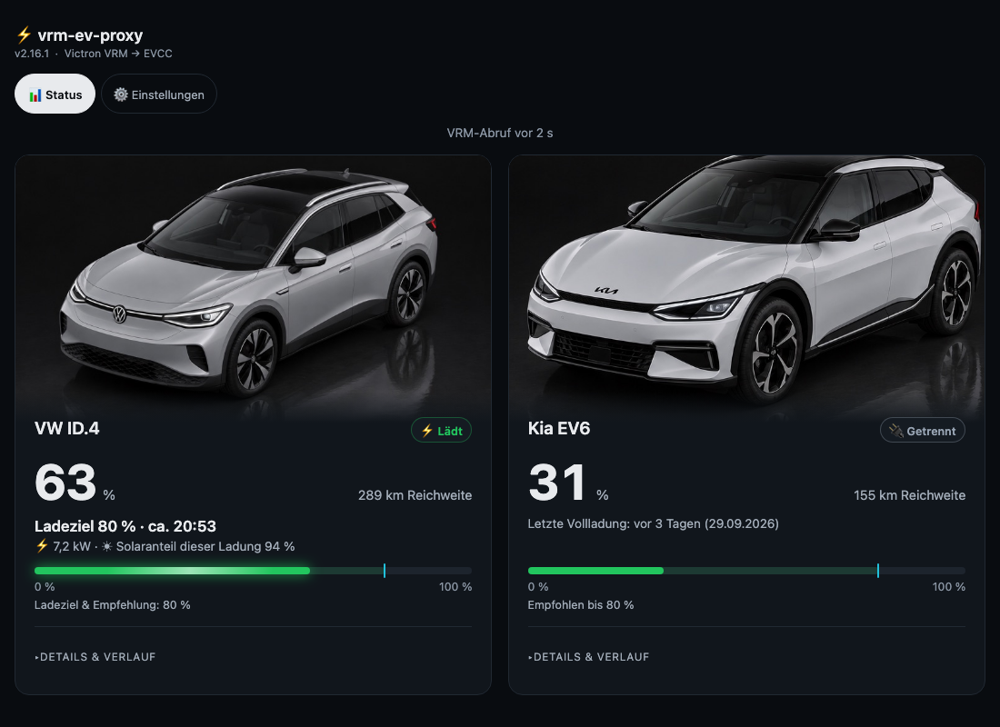
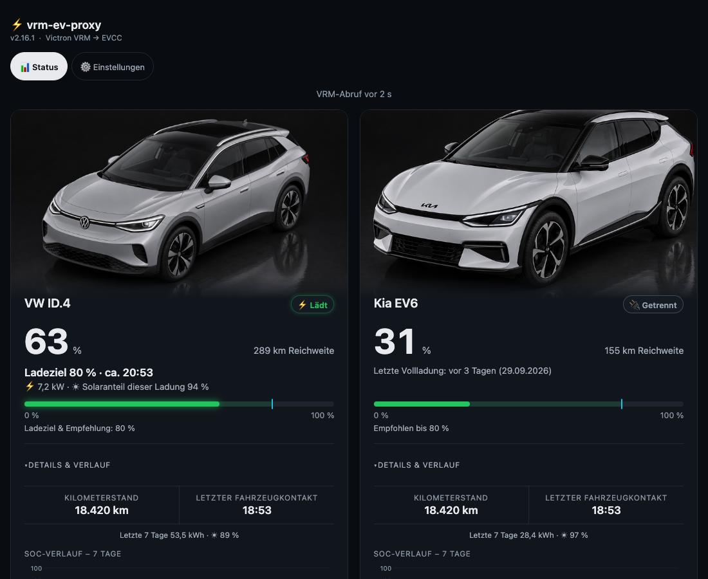
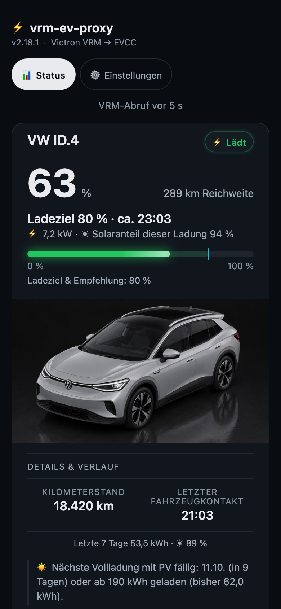
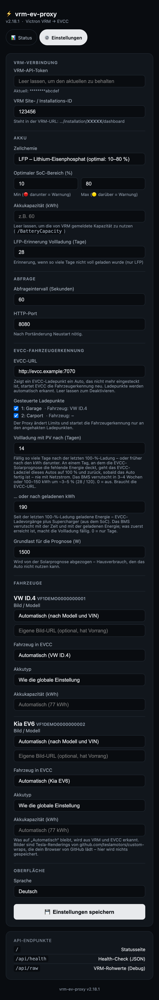

# vrm-ev-proxy

[English](README.en.md) · [Deutsch](README.md)

Bringt den Fahrzeugstatus aus Victron VRM in evcc – für Automarken, die VRM anbindet (bisher nur mit Teslas getestet, siehe „Getestet mit“) – und automatisiert zusätzlich regelmäßige Vollladungen für LFP-Akkus, wenn die Solarprognose es erlaubt.

## Warum es dieses Projekt gibt

**Der Ausgangspunkt:** evcc braucht den Ladestand und die Reichweite des Autos, um sinnvoll zu laden. Wer ein Victron-System hat, hat das Auto meist schon in VRM: Die Anbindung der einzelnen Hersteller übernimmt VRM. Statt das Auto ein zweites Mal direkt in evcc anzubinden, reicht dieser Proxy die VRM-Daten im Tesla-Format an evcc weiter. Es entsteht keine zweite Verbindung zum Fahrzeug, und der Proxy ist nicht an eine Marke gebunden. Das ist der Kern des Projekts.

**Die Zusatzfunktion:** Auf dieser Brücke sitzt die Vollladungs-Automatik. „Wann habe ich das letzte Mal auf 100 % geladen?“ soll keine weitere Frage sein, an die man denken muss.

Gebaut hat das ein Besitzer von LFP-Elektroautos mit Victron VRM und evcc. LFP-Akkus brauchen regelmäßige Vollladungen für das Balancing der Zellen durch das BMS und die Kalibrierung des Ladestands: Wegen der flachen Spannungskurve zählt das BMS Energie, und diese Schätzung driftet. Der UI-Hinweis im Code nennt grob **3–5 % in 3–4 Wochen oder 100–150 kWh**; das ist keine Messung des eigenen Akkus. Im Alltag lädt man meist nur bis etwa 80 %, um die Zeit bei hohem Ladestand zu begrenzen.

Von Hand bedeutet das: letzte Vollladung merken, einen sonnigen Tag erwischen, das evcc-Limit auf 100 % setzen und später wieder zurückstellen. Der Proxy übernimmt diese Folge: 100 % je Fahrzeug erfassen, die nächste Vollladung fällig stellen, eine passende Solarprognose abwarten, das evcc-Limit vorübergehend anheben und nach Ladeende den Alltagswert wiederherstellen.

Das Ziel ist **zero-touch nach der Einrichtung**: wie gewohnt anstecken; evcc übernimmt das Überschussladen und der Proxy den Zeitpunkt für die Vollladung. Der Betreiber nutzt **14 Tage oder 190 kWh für einen 60-kWh-LFP-Akku**. Das sind einstellbare Werte, keine Standardwerte oder allgemeine Akkuempfehlung. Genügend Sonne und eine passende evcc-Konfiguration bleiben Voraussetzung. Wer die Vollladung nicht braucht, setzt beide Schwellen auf 0 und nutzt nur die Brücke.

## Screenshots

Alle Screenshots verwenden **erfundene Demodaten**: VINs mit `VF1DEMO…`, Site-ID `123456` und einen Demo-Token. Sie zeigen die deutsche Oberfläche; Englisch ist ebenfalls verfügbar.



*Desktop: Ein Fahrzeug lädt, eines ist getrennt; Ladestand, Reichweite, Ladeziel, geschätzte Endzeit und Solaranteil sind direkt sichtbar.*



*Aufgeklappte Details: Kilometerstand, letzter Fahrzeugkontakt, Wochenzeile mit kWh/Solar und Beginn des SoC-Verlaufs.*



*Mobil: Die Karten stehen untereinander; Ladeziel und Solaranteil bleiben auf dem Handy gut lesbar.*



*Einstellungen: VRM-Verbindung, Akkuprofil, Abfrageintervall, evcc-Anbindung, Vollladeschwellen und Fahrzeugbilder.*

## Funktionen

- **Regelmäßige Vollladungen ohne Kalender:** Tage **oder** geladene kWh machen ein Fahrzeug fällig; ein viel gefahrenes Auto kann dadurch früher an die Reihe kommen.
- **Fahrzeugerkennung nach schnellem Wechsel:** Tauscht man zwei Autos zwischen evcc-Abfragen, kann das alte am Ladepunkt stehen bleiben. Erkennt der Proxy die falsche Zuordnung während des Ladens, fordert er eine neue Erkennung an.
- **Fahrzeugstatus aus VRM in evcc, markenunabhängig:** VRM bindet die Hersteller an; der Proxy stellt deren Daten im Tesla-Format bereit, sodass evcc sie über das Template `tesla-ble` abruft. Es entsteht keine zweite Verbindung zum Fahrzeug.
- **Status für Handy oder Wandtablet:** Normale Aktualisierungen ersetzen nur geänderte Seitenbereiche; Details bleiben offen und die Ladeanimation läuft weiter. Nach 30 Minuten oder einer unerwarteten Strukturänderung wird vollständig neu geladen.
- **Antworten beim Laden:** „Ladeziel 80 % · ca. HH:MM“ und der Solaranteil der Sitzung zeigen, wann das Laden voraussichtlich fertig ist und wie viel davon aus Sonne stammt. Die Endzeit ist aus der aktuellen Leistung geschätzt. Die Wochenzeile mit kWh/Solar stammt aus evcc-Ladesitzungen.
- **Ehrliche Aktualität:** „VRM-Abruf vor X s“ oder „Daten veraltet“ bezieht sich auf den VRM-Abruf. Der separat angezeigte letzte Fahrzeugkontakt kann älter sein. Ein erfolgreicher VRM-Abruf bedeutet keinen gerade erfolgten Kontakt zum Auto.
- **Akkukontext und Bilder:** LFP/NMC-Profile, Alltagsbereich im SoC-Balken, Hinweis darüber, stündlicher Verlauf, geschätzte Ladezyklen und Zeit über dem eingestellten Maximum. Die fließende Ladeanimation ähnelt der Anzeige im Auto; Bilder helfen, Fahrzeuge zu unterscheiden.

## So funktioniert die Vollladung

1. **Gemeldete 100 % selbst erfassen.** Der Proxy speichert je VIN den ersten beobachteten Sprung auf 100 %, unabhängig vom Ladeort. Bleibt das Auto bei 100 % stehen, wandert das Datum nicht weiter. Der SoC wird abgeschnitten: 99,6 % bleiben 99 %.
2. **Nach Zeit oder Energie fällig werden.** `FULL_CHARGE_DAYS` zählt Kalendertage seit der letzten Vollladung; `FULL_CHARGE_KWH` zählt seitdem geladene Energie. Eine erreichte Schwelle genügt. Die Energie stammt aus evcc-Sitzungen plus beobachteten SoC-Anstiegen × Kapazität, während das Auto außerhalb der Anlage Laden meldet. So zählt neben der Zeit auch die Nutzung. Ohne erfasste Vollladung dient die erste Prüfung als Zeitreferenz.
3. **Einen passenden Sonnentag abwarten.** Höchstens alle fünf Minuten prüft der Proxy die evcc-Prognose und einen verbundenen Ladepunkt mit dem zugeordneten Fahrzeug. Er zieht die Hausgrundlast ab (Standard 1500 W), begrenzt den Überschuss auf die Ladepunktleistung und vertraut 80 % des Rests. Die fehlende Akkuenergie wird mit 90 % Ladeeffizienz berechnet. Die Restprognose muss sie decken; außerdem muss der **aktuelle Prognose-Zeitschritt** über der Grundlast liegen. Diese Tageslichtprüfung misst weder Sonnenschein noch tatsächliche PV-Leistung.
4. **Nur das evcc-Fahrzeuglimit anheben.** Der Proxy merkt sich das bisherige Limit und setzt es auf 100 %. Er erstellt keinen Plan und verändert weder Lademodus noch Tarifeinstellung oder Strom. **evcc muss für Überschussladen im Modus `pv` eingerichtet sein**, ohne Pläne oder Smart-Cost-Einstellungen, die Netzladen erlauben; die Energiequelle bestimmt weiterhin evcc. Das Limit im Auto muss 100 % bereits erlauben.
5. **Das Auto fertig balancieren lassen.** Manche Autos melden 100 %, bevor das Nachladen abgeschlossen ist (zum Beispiel Tesla). Der Proxy wartet, bis VRM 100 % und **30 Minuten** lang kein Laden des Fahrzeugs meldet; eine Lademeldung setzt den Timer zurück. Dann stellt er den gespeicherten Wert am evcc-Fahrzeug **und**, falls noch verbunden, am Ladepunkt wieder her. Beide Schreibzugriffe sind nötig: evcc reicht ein gesenktes Fahrzeuglimit sonst nicht an einen bereits verbundenen Ladepunkt weiter.
6. **Den Versuch passend beenden.** Das gespeicherte Limit kommt auch zurück, wenn die Funktion deaktiviert wird, ein neuer Tag beginnt oder unter 100 % weniger als 0,5 kWh prognostizierter Restüberschuss für heute übrig ist. Wurden während des Versuchs 100 % erfasst, beenden auch Abstecken oder Fahren den Versuch. **Abstecken vor 100 % bricht ihn nicht sofort ab; eine vorbeiziehende Wolke ebenfalls nicht.** Eine unvollständige Vollladung bleibt fällig und kann an einem passenden Sonnentag erneut versucht werden.

Implementiert in [`poll_vrm` und `_full_charge_pv`](app.py). Gespeichert wird ein evcc-Fahrzeuglimit von **1–99 %**, kein separates vorheriges Ladepunktlimit. Vor dem Aktivieren ein Alltagslimit wie 80 % am evcc-Fahrzeug einstellen.

### Die drei Limit-Ebenen

| Limit | Zweck | Verhalten des Proxys |
|---|---|---|
| Im Auto | Obergrenze des Fahrzeugs selbst | Nie verändert; muss für eine Vollladung 100 % erlauben. |
| Am Fahrzeug in evcc | Alltagswert, z. B. 80 % | Vorübergehend auf 100 % gesetzt; der gespeicherte Alltagswert kommt zurück. |
| Am Ladepunkt in evcc | Hier stoppt evcc das Laden tatsächlich | Wird ausdrücklich auf den gespeicherten **Fahrzeugwert** zurückgesetzt, solange dieses Auto dort verbunden ist. |

### Checkliste für den Betrieb ohne Handgriffe

Einmal einrichten; danach muss niemand mehr fragen „wann habe ich zuletzt auf 100 % geladen?“.

- [ ] Im Auto: Ladelimit so setzen, dass **100 %** erlaubt sind. Der Proxy ändert es nie.
- [ ] In evcc: **Tageslimit des Fahrzeugs** (z. B. 80 %) setzen und den Ladepunkt im **`pv`-Modus** ohne Pläne oder Netzladung über Smart-Cost betreiben.
- [ ] In evcc: die Solarprognose aktivieren; der Proxy verlässt sich darauf.
- [ ] In den Proxy-Einstellungen: `FULL_CHARGE_DAYS` und `FULL_CHARGE_KWH` (eines von beiden macht eine Vollladung fällig) sowie die evcc-URL eintragen.
- [ ] Statusseite prüfen: Jedes Auto zeigt die letzte Vollladung und darunter, wann die nächste fällig ist.

### Wo man es sieht

- **Statusseite, Fahrzeugkarte:** „Letzte Vollladung“ mit Datum.
- **Statusseite, Details:** „Nächste Vollladung mit PV fällig: …“, „Vollladung fällig – heute reicht die PV nicht (Prognose … kWh, nötig … kWh).“ oder, während sie läuft, „Vollladung mit PV läuft seit … – EVCC-Ladeziel 100 %.“
- **Log:** Der Proxy protokolliert jeden Schritt, zum Beispiel

```text
[FULL] <Auto>: last 100 % 15 days / 120 kWh ago, PV today 38.2 kWh ≥ 14.9 kWh needed – EVCC limit 80 → 100 %
[FULL] <Auto>: 100 % and charging finished for 30 min – EVCC limit back to 80 %
```

## Was der Proxy in evcc tut

Benötigt `EVCC_URL`, z. B. `http://evcc.example:7070`. Ladepunktnummern `<n>` beginnen bei 1; `<name>` ist die Fahrzeugkennung in evcc.

| Aktion | Endpunkt | Wann |
|---|---|---|
| Zustand lesen | `GET /api/state` | Erkennungsprüfung während des Ladens; Vollladeprüfung; Statusanzeige (20 s Cache für die Anzeige). |
| Ladesitzungen lesen | `GET /api/sessions` | Wochenstatistik und kWh-Schwelle; 15 Minuten zwischengespeichert. |
| Fahrzeugerkennung anfordern | `PATCH /api/loadpoints/<n>/vehicle` | Ladender Ladepunkt zeigt ein eindeutig zugeordnetes, hier getrenntes Fahrzeug oder kein Fahrzeug bei passender Ladeleistung; höchstens einmal je fünf Minuten und Ladepunkt. |
| Vollladung erlauben | `POST /api/vehicles/<name>/limitsoc/100` | Fahrzeug fällig, verbunden und Prognoseprüfungen bestanden. |
| Fahrzeuglimit zurücksetzen | `POST /api/vehicles/<name>/limitsoc/<old>` | Bei Abschluss oder den genannten Endbedingungen, falls ein Alltagslimit gespeichert wurde. |
| Ladepunktlimit zurücksetzen | `POST /api/loadpoints/<n>/limitsoc/<old>` | Bei derselben Rücksetzung, falls das zugeordnete Auto dort noch verbunden ist. |

Die Fahrzeugzuordnung nutzt Reichweite und bei Bedarf SoC; mehrdeutige Treffer werden übersprungen. VRM kann die Stationsverbindung eines früheren Autos behalten: Stationsdaten erhält das Fahrzeug mit eigener Aktivität, sonst der zuletzt kontaktierte Kandidat. Andere Kandidaten übernehmen diese Stationswerte nicht; ihr eigener VRM-Ladezustand wird weiterhin ausgewertet.

## Wie der Proxy dein evcc-Fahrzeug findet

Damit der Proxy auf jeder Installation das Limit ändern kann, braucht er den **Fahrzeugnamen in evcc** (Aufruf `POST /api/vehicles/<name>/limitsoc/…`). Er findet ihn selbst:

1. **evcc-Adresse:** `EVCC_URL` (in `.env` oder in den Einstellungen).
2. **Zuordnung VIN → evcc-Fahrzeug:**
   - **Durch Lernen:** sobald evcc ein Auto an einem Ladepunkt zeigt, ordnet der Proxy es über Reichweite und Ladestand dem VRM-Auto zu und merkt sich das. Mehrdeutige Treffer, etwa zwei fast gleich geladene Autos, überspringt er. Dann hilft die Handauswahl (Punkt 4).
3. **Ladepunkt:** Sein Limit liest der Proxy aus dem evcc-Zustand und setzt es bei der Rückstellung zusätzlich zurück.

4. **Von Hand, wenn die Erkennung nicht reicht:** In den Einstellungen gibt es einen Abschnitt **Fahrzeuge** mit einer Zeile je VIN: Bild/Modell, **Fahrzeug in EVCC** (die Liste kommt aus einem Scan von evcc), **Akkutyp** und **Akkukapazität**. Was auf „Automatisch“ bleibt, wird erkannt. Darunter wählt **Gesteuerte Ladepunkte** aus dem Scan, an welchen Wallboxen der Proxy Limits ändern und die Fahrzeugerkennung neu anstoßen darf. Standard sind alle.

Das Limit im Auto ändert der Proxy nie. Hat evcc eine Anmeldung, funktioniert die Anbindung nicht: Der Proxy sendet keine evcc-Zugangsdaten.

## Schnellstart

Benötigt Docker, Docker Compose, eine VRM-Anlage mit einem Electric-Vehicle-Gerät und Netzwerkzugriff auf VRM. Die mitgelieferte Compose-Datei nutzt **Host-Netzwerkbetrieb**. Das Dockerfile verwendet Python 3.12 und ausschließlich die Standardbibliothek.

In einem Checkout dieses Repositories:

```sh
cp .env.example .env
# .env bearbeiten: Beispielzugang ersetzen oder beide Werte für die Browsereinrichtung leeren.
docker compose up -d --build
```

Beispiel für `.env` (erfundenen Zugang ersetzen oder beide VRM-Werte leeren):

```dotenv
VRM_TOKEN=REPLACE_WITH_VRM_API_TOKEN
VRM_SITE_ID=123456
POLL_INTERVAL=60
PORT=8080
TZ=Europe/Berlin
# evcc-Adresse, optional (leer = evcc-Funktionen aus); alternativ in den Einstellungen setzen
EVCC_URL=http://evcc.example:7070
```

`http://proxy.example:8080/settings` öffnen. Sind beide VRM-Werte leer, leitet `/` zur ersten Einrichtung dorthin weiter. Einstellungen und Verlauf bleiben im Compose-Volume unter `/config` erhalten.

In evcc ein Fahrzeug hinzufügen; für jedes Auto mit dessen tatsächlicher VIN wiederholen. Das Template `tesla-ble` dient hier nur als technischer Zugang zum Proxy und ist nicht auf Tesla beschränkt; bei anderen Marken hängt es davon ab, was VRM liefert (siehe „Getestet mit“). Die folgenden Werte sind Platzhalter:

```yaml
vehicles:
  - name: demo_ev
    type: template
    template: tesla-ble
    title: Demo EV
    vin: VF1DEMO00000000001
    url: http://proxy.example
    port: 8080
    capacity: 60
```

Bei `tesla-ble` **den Port aus `url` weglassen**: Das Template hängt das separate `port` an. Diese Schnittstelle liefert Daten; Fahrzeugbefehle werden als No-Ops bestätigt.

In den Proxy-Einstellungen `EVCC_URL` auf `http://evcc.example:7070` setzen, passende Schwellen wählen und das Alltagslimit am Fahrzeug in evcc einstellen. Alternativ lassen sich diese Werte in den Compose-Dienst schreiben (oder ein Compose-Override nutzen):

```yaml
services:
  vrm-ev-proxy:
    environment:
      EVCC_URL: http://evcc.example:7070
      FULL_CHARGE_DAYS: "14"
      FULL_CHARGE_KWH: "190"
    volumes:
      - config:/config
```

Für ein Quellcode-Update den Checkout aktualisieren und `docker compose up -d --build` ausführen. Für ein Update des veröffentlichten Images `docker compose pull`, danach `docker compose up -d --no-build` ausführen.

## Konfiguration

Unter `/settings` lassen sich VRM-Zugang, Akkuprofil, Abfrageintervall, evcc-Anbindung, Bilder und Sprache einstellen. Den Token in den API-Token-Einstellungen des VRM-Portals erstellen; die Site-ID steht in `/installation/123456/dashboard`. Ein leeres Token-Feld behält den vorhandenen Token.

Nicht leere Werte in `/config/settings.json` haben Vorrang vor Umgebungsvariablen. Die meisten Änderungen gelten beim nächsten Abruf oder Seitenaufruf; **ein geänderter `PORT` benötigt einen Neustart**. Wird eine Einstellung mit vorhandenem Umgebungswert geleert, gilt wieder dieser Wert. Einstellungen sind global, sofern nicht ausdrücklich fahrzeugbezogen (Bilder und Erfassung).

| Variable | Standard / Bedeutung |
|---|---|
| `VRM_TOKEN` | Erforderlicher VRM-API-Token. |
| `VRM_SITE_ID` | Erforderliche numerische Installations-ID. |
| `POLL_INTERVAL` | `60` Sekunden; UI-Bereich 10–3600. |
| `PORT` | `8080`; nach Änderung neu starten. |
| `TZ` | `Europe/Berlin` in Compose; Container-Zeitzone, keine UI-Einstellung. |
| `BATTERY_TYPE` | `LFP`; alternativ `NMC`. Globales Anzeige-/Erfassungsprofil. |
| `CAPACITY` | Ohne Wert: VRM `/BatteryCapacity`; globale Vorgabe 1–200 kWh. |
| `OPT_MIN`, `OPT_MAX` | LFP 10–80 %, NMC 20–90 %; einstellbarer Alltagsbereich der Anzeige. |
| `FULL_REMINDER_DAYS` | `28` bei LFP; nur UI-Erinnerung, getrennt von der Automatik. |
| `FULL_CHARGE_DAYS` | `0` (aus); 0–60 Kalendertage. |
| `FULL_CHARGE_KWH` | `0` (aus); 0–2000 geladene kWh. Jede aktive Schwelle kann das Fahrzeug fällig machen. |
| `FULL_CHARGE_BASE_LOAD` | `1500` W; Abzug von der Solarprognose, einstellbar 0–20000 W. |
| `EVCC_URL` | Leer: evcc-Anbindung aus. Beispiel: `http://evcc.example:7070`. |
| `LANGUAGE` | `auto` (Browsersprache), `en` oder `de`; nur die Oberfläche. |

Die mitgelieferte Compose-Datei übergibt nur VRM-Zugang, Abfrageintervall, Port und Zeitzone. Weitere Variablen unter `environment` ergänzen oder die Einstellungsseite nutzen. Bei unbekannter Kapazität nehmen Vollladeplanung und Status-Endzeit 60 kWh an; deshalb eine passende Kapazität hinterlegen. Die API-Zeitschätzung benötigt eine bekannte Kapazität.

Zum Abschalten der Vollladeautomatik **beide Schwellen auf 0** setzen. Bei einem laufenden Versuch `EVCC_URL` erreichbar lassen, bis das gespeicherte Limit zurückgesetzt wurde. Die Automatik prüft `BATTERY_TYPE` nicht; die Auswahl NMC allein deaktiviert sie nicht.

## Fahrzeugbilder

Im Abschnitt **Fahrzeuge** der Einstellungen bietet jedes Auto automatische Auswahl, ein bestimmtes Modell, kein Bild oder eine **eigene HTTP(S)-Bild-URL**; die eigene URL hat Vorrang.

Tesla-Renderings lädt **der Browser** aus [github.com/teslamotors/custom-wraps](https://github.com/teslamotors/custom-wraps) über GitHubs Raw-Content-Host. Sie werden **nicht in diesem Repository gespeichert**. Die automatische Tesla-Auswahl nutzt Modellname/VIN und Modelljahr; weitere Tesla-Varianten sind manuell auswählbar.

Die mitgelieferten JPEGs in [`images/`](images/) sind **KI-generierte Studio-Darstellungen** für VW ID.4, Kia EV6, Hyundai Ioniq 5, Ford Mustang Mach-E, Mini Countryman, Porsche Macan und Volvo EX40/XC40. Die lokale Auswahl nutzt Teile des Modellnamens. Der Proxy liefert sie unter `/img/<id>.jpg`; ein nicht erreichbares externes Bild wird ausgeblendet.

## Endpunkte

| Methode | Pfad | Ergebnis |
|---|---|---|
| `GET` | `/`, `/status` | Statusseite; Weiterleitung zu den Einstellungen, solange VRM-Zugang fehlt. |
| `GET` / `POST` | `/settings` | Einstellungsformular / Einstellungen speichern. |
| `GET` | `/api/1/vehicles/<VIN>/vehicle_data` | Tesla-Format `response.response.charge_state`; HTTP 503 ohne Daten oder bei zu alten Daten. |
| `POST` | `/api/1/vehicles/<VIN>/command/<command>` | Bestätigter No-Op, z. B. `wake_up`, `charge_start`, `set_charging_amps`. |
| `GET` | `/api/health` | JSON-Status `ok`, `error` oder `stale`, Alter, Fehler, Site-ID und Version; HTTP 503 bei error/stale. |
| `GET` | `/api/raw` | Zwischengespeicherte VRM-Rohwerte je Fahrzeug samt zugeordneten Ladestationswerten. |
| `GET` | `/img/<id>.jpg` | Mitgeliefertes Modellbild, sofern die ID unterstützt wird. |

`charge_state` enthält `battery_level`, `usable_battery_level`, `battery_range` (**Meilen**), `charge_limit_soc` (das von VRM gemeldete Autolimit), `charge_amps`, `charge_current_request`, `charging_state`, `charger_power`, `charge_energy_added` (kWh), `minutes_to_full_charge`, `time_to_full_charge` (Stunden) und `timestamp`. API-Zeitschätzungen nutzen das Autolimit; die Statusseite bevorzugt dagegen das wirksame evcc-Limit für Ladeziel/Endzeit. Die Sitzungsenergie stammt zuerst aus Stations-`/Session/Energy`, dann aus Differenzen von Fahrzeug-`/Ac/Energy/Forward`, zuletzt aus Leistungsintegration.

Die Oberfläche warnt nach `max(180 s, 3 × POLL_INTERVAL)` ohne erfolgreichen VRM-Abruf. Fahrzeugdaten und Health gelten nach `max(1800 s, 10 × POLL_INTERVAL)` als veraltet. Fahrzeugantworten enthalten `X-Data-Age-Seconds`. Der Docker-Healthcheck prüft nur die Erreichbarkeit des HTTP-Servers und akzeptiert eine 503-Antwort; „healthy“ garantiert keine frischen VRM-Daten.

## Fehlerbehebung

- **Keine Daten:** Token und Site-ID unter `/settings` prüfen, danach `docker compose logs --tail=100 vrm-ev-proxy` und `/api/health`.
- **`No EV device found`:** Die Anlage muss in VRM ein Electric-Vehicle-Gerät bereitstellen; der Proxy legt keines an.
- **Falsche Uhrzeit/Datumsangaben:** `TZ` in Compose auf die gewünschte Zeitzone setzen und den Container neu erstellen.
- **evcc-Verbindungsfehler:** `url: http://proxy.example` und `port: 8080` verwenden, ohne den Port in der URL zu wiederholen.
- **Falsches Fahrzeug:** VIN mit der Proxy-Anzeige abgleichen. Groß-/Kleinschreibung spielt keine Rolle; unbekannte VINs liefern das erste Fahrzeug. Bei mehreren Fahrzeugen wird je unbekannter VIN einmal gewarnt. Mehrdeutige Treffer lösen keine Neuerkennung aus.
- **Keine evcc-Statistik oder Automatik:** Ist `EVCC_URL` gesetzt, aber falsch (nicht erreichbar, falscher Port oder Pfad, Anmeldung nötig, keine evcc-Antwort), zeigt die Statusseite oben eine rote Fehlermeldung mit dem Grund. Außerdem: `EVCC_URL`, Erreichbarkeit, VIN-Zuordnung (Einstellungen → Fahrzeuge → Fahrzeug in EVCC) prüfen. Der Client sendet keine evcc-Anmeldedaten; eine API mit Authentifizierung schlägt fehl. Im Log nach `[EVCC]`, `[LIVE]` oder `[FULL]` suchen.
- **Vollladung bleibt fällig:** Prüfen, ob das zugeordnete Auto verbunden ist und evcc eine ausreichende Solarprognose liefert. Im Winter kann das dauern; die Details zeigen dann „fällig“. Das Auto muss selbst 100 % erlauben und evcc PV-Überschussladen nutzen.
- **Limit kommt nicht zurück:** 30 Minuten nach Ladeende abwarten, evcc-API-Fehler prüfen und `EVCC_URL` eingerichtet lassen. Nur ein gespeichertes Alltagslimit von 1–99 % kann wiederhergestellt werden.

Weitere Implementierungshinweise: [BUGS.md](BUGS.md).

## Getestet mit – und was darüber hinaus nur angenommen ist

Entwickelt und getestet wurde auf **einer** Installation: Victron EV Charging Station, zwei Teslas über VRM, evcc mit in der Oberfläche angelegten Fahrzeugen, aktiver Solarprognose, ohne evcc-Anmeldung. Dass es dort läuft, heißt nicht, dass es überall läuft. Nicht geprüft sind:

- **Andere Marken in VRM.** Der Proxy liest das VRM-Gerät „Electric Vehicle“ (`/Soc`, Reichweite, `/ChargingState`, optional `/VIN`, `/BatteryCapacity`). Liefert VRM bei einer Marke andere oder weniger Felder, fehlen Werte oder die Zuordnung. Ohne VIN nutzt der Proxy eine Ersatzkennung; die Zuordnung über die evcc-Datenbank geht dann nicht, das Lernen über Reichweite und Ladestand schon.
- **Andere Wallboxen.** Die Stationslogik (`/Mgmt/Connection`, Status, Sitzungsenergie) gilt nur für Victron-Ladestationen. Für andere Wallboxen kommen Ladeleistung und Ladeziel aus evcc und dem Fahrzeugstatus.
- **Fahrzeuge aus der `evcc.yaml`.** Bei Fahrzeugen aus der Datei hilft das Lernen (setzt voraus, dass das evcc-Fahrzeug Reichweite und Ladestand **vom Proxy** bezieht, Template `tesla-ble`) oder die **Handauswahl** je Auto in den Einstellungen.
- **Andere evcc-Versionen.** Gebraucht werden `/api/state` mit Ladepunkten, Fahrzeug-Limit, Solarprognose-Zeitreihe und die Schreibaufrufe unter `/api/vehicles/<name>/limitsoc/…`. Eine Mindestversion ist nicht bestimmt.
- **Gleiche Fahrzeugtitel.** evcc-Sitzungen werden über den Titel zugeordnet; zwei Autos mit gleichem Titel vermischen ihre kWh.
- **Akkukapazität.** Reihenfolge: Kapazität des Autos in den Einstellungen, sonst die globale `CAPACITY`, sonst der VRM-Wert, sonst die Kapazität des evcc-Fahrzeugs, zuletzt 60 kWh. Bei verschieden großen Autos je Auto eintragen. Dasselbe gilt für den Akkutyp (LFP/NMC).

Passt etwas davon nicht, bleibt die Vollladung auf „Zuordnung fehlt“ und ist evcc falsch eingetragen, zeigt die Statusseite einen Fehler – der Proxy greift nicht blind in evcc ein.

## Grenzen

- **Keine Steuerung im Auto:** evcc-Befehle sind No-Ops. Der Proxy kann das Auto weder wecken noch dessen Limit verändern, Laden starten oder den Strom setzen. Echte Fahrzeugsteuerung benötigt eine separate Integration.
- **Keine Änderungen an Modus, Plänen, Tarif oder Strom:** Ein höheres Limit wählt nicht selbst Solarstrom aus. Bestehende evcc-Einstellungen bestimmen, ob Netzstrom genutzt werden kann; der Proxy garantiert keine netzstromfreie Ladung.
- **evcc für VRM-Daten optional, für evcc-Funktionen erforderlich:** Vollladeautomatik, Neuerkennung, wirksame Ladeziele und Solar-/Sitzungsstatistik benötigen `EVCC_URL`. Die UI-Statistik braucht außerdem eine gelernte VIN-Zuordnung.
- **VRM-Daten werden abgefragt, sind nicht live:** Standardintervall 60 Sekunden, bei Fehlern längere Wartezeiten. Der Fahrzeugkontakt kann noch älter sein. Eine 100-%-Meldung und ein Timer beweisen kein abgeschlossenes Zellbalancing.
- **Vollladungen hängen von Sonne ab:** Eine zu schwache oder fehlende Prognose lässt das Auto fällig bleiben. Es wird kein Netzstrom-Ersatzplan angelegt.
- **Erfassung beruht auf Beobachtung:** Nicht beobachtete Ladungen/SoC-Änderungen können fehlen; auswärts geladene Energie und Zyklen sind Schätzungen. evcc-Sitzungen werden nach Fahrzeugtitel zugeordnet; die Wochenzeile zählt im Zeitraum begonnene Sitzungen.
- **Keine HTTP-Authentifizierung:** Wer den Server erreichen kann, kann Status/Rohdaten ansehen und Einstellungen ändern. Das Einstellungsformular liefert den vollständigen VRM-Token nicht zurück.

## Danksagung und Bildhinweis

Nutzt Fahrzeugdaten aus Victron VRM und die HTTP-API von evcc; die Tesla-Fahrzeugdatenschnittstelle ist mit evccs Template `tesla-ble` kompatibel. Danke an diese Projekte und die oben verlinkte Quelle der Tesla-Renderings.

Produktnamen, Marken und Herstellerlogos gehören ihren jeweiligen Rechteinhabern. Das Projekt beansprucht keine Rechte an Herstellerlogos und stellt keine Herstellerzugehörigkeit oder Unterstützung durch Hersteller dar. Fahrzeugbilder sind illustrativ; KI-generierte Darstellungen können vom tatsächlichen Modell abweichen.

## Lizenz

MIT. Das Repository enthält noch keine separate `LICENSE`-Datei.
